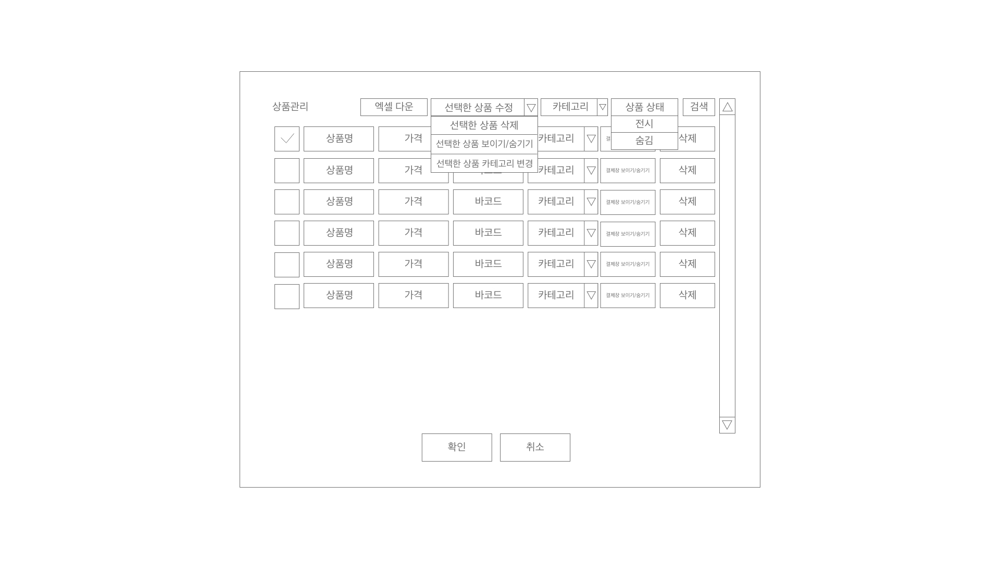
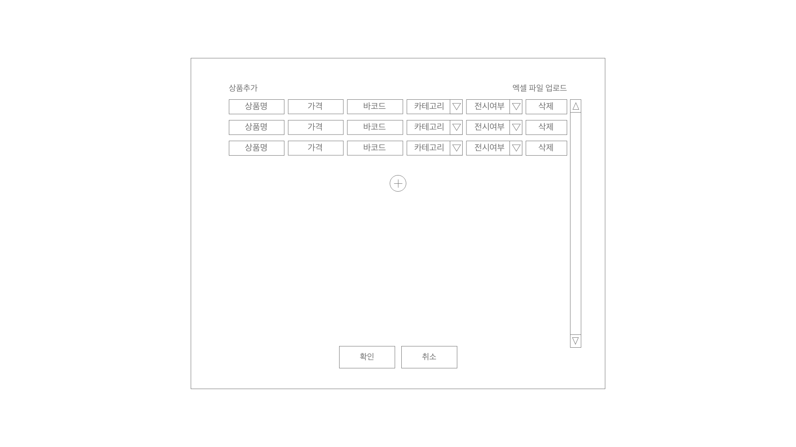

# POS

## 레이아웃

### 카테고리별 보기

<image src="./images/payment_view1.jpg" width="800px">

### 전체 보기

<image src="./images/payment_view2.jpg" width="800px">

### 헤더

- [x] 상품관리,판매내역,현금점검,대시보드 버튼을 누를 경우 모달 창 표시

#### 보기모드

- [x] 버튼 클릭 시 드롭다운 형식으로 모드 선택
  - 카테고리별 보기모드
  - 전체 보기모드
- [x] 선택한 모드로 상품을 렌더
- [x] 보기모드 선택 후 드롭다운을 접는다.
- [x] 버튼에 현재 선택된 모드가 텍스트로 표시된다.
- [x] 드롭다운을 펼쳤을 때 현재 선택된 모드를 표시한다.
- [x] 버튼 외의 부분을 누르면 드롭다운이 접힌다.

---

#### 상품탭

- [x] 버튼 클릭 시 드롭다운에 메뉴 표시
  - [x] 상품 관리,상품 추가,카테고리 관리

##### 상품관리

- [x] 상품 데이터를 서버에서 불러온다.
- [x] 상품 데이터에 저장되어 있는 모든 상품에 대해 표시한다.

- [x] 상품별 표시 정보
- 상품 선택 박스
- 상품명 (input)
- 가격 (input)
- 바코드 (input)
- 카테고리
- 전시상태
- 판매수량
- 삭제버튼

- 삭제
- [x] '상품을 삭제하시겠습니까?' 메시지를 표시하고 확인/취소 버튼을 입력받는다.
- [x] 판매수량이 0 이상인 경우 삭제 불가
- [x] 서버에서 상품 데이터를 불러온다.
- [x] 상품 데이터에서 상품을 삭제한다.
- [x] 상품을 서버에 업데이트 한다.
- [x] 상품 관리 목록에 해당 목록을 삭제한다.

- [x] 확인 버튼을 누르면 변경사항을 저장한다.
- [x] 확인 버튼을 누르면 상품목록을 다시 렌더링한다.
- [x] 취소 버튼을 누르면 변경사항을 저장하지 않고 모달을 닫는다.

- 상품 정보 필터링 기능
- [ ] 카테고리
- [ ] 상품 전시 여부
- [ ] 검색버튼을 누르면 선택한 조건으로 상품을 조회한다.

##### 상품추가

- [x] 상품 정보를 서버에서 불러온다.
- [x] 상품명을 입력받는다.
- [x] 가격을 입력받는다.
- [x] 바코드를 입력받는다.
- [x] 카테고리를 선택한다.
- [x] 전시 여부를 선택한다.

- 확인 버튼을 누르면 입력한 데이터에 대한 유효성 검사를 실시한다.

  - [x] 이미 존재하는 상품명일 경우 예외처리
  - [x] 가격이 0 이상의 자연수가 아닐 경우 예외처리
  - [x] 공백이 아닌 바코드 중 중복되는 바코드가 존재할 경우 예외처리
  - [x] 반드시 입력해야하는 값 : 이름,가격

- [x] 카테고리의 최초 선택 옵션은 카테고리없음으로 설정
- [x] 바코드는 입력하지 않을 경우 공백으로 처리

- [x] 입력한 상품정보를 업데이트 후 서버에 저장한다.
- [x] 취소 버튼을 누르면 변경내용을 취소하고 모달창을 닫는다.
- [x] 창을 닫은 후 상품목록을 업데이트한다.

##### 카테고리 관리

- 카테고리 표시
- [ ] 카테고리 정보를 서버에서 불러온다.
- [ ] 카테고리 이름을 Input창을 통해 표시 (수정 가능)

- 삭제 버튼
- [ ] '카테고리를 삭제하시겠습니까?'메시지를 표시하고 예/아니오를 입력받는다.
- [ ] 카테고리에 상품이 없을 경우 삭제된다.
- [ ] 카테고리에 상품이 있을 경우 경고창이 표시되고 삭제되지 않는다.

- 확인 버튼
- 카테고리 이름을 추가/변경한 경우
- [ ] 중복된 카테고리 이름이 있을 경우 경고창이 표시된다.
- [ ] 중복된 카테고리 이름이 없을 경우 수정된 이름을 카테고리 정보에 저장한다.
- [ ] 수정된 이름을 상품정보 중 기존에 속해있던 상품에 적용한다.
- [ ] 변경사항이 저장된다.

- 플러스 버튼
- [ ] 버튼을 누르면 카테고리가 표시된 줄이 입력창이 빈 상태로 하나 더 생긴다.

- 취소 버튼
- [ ] 변경사항을 모두 리셋한다.

---

#### 판매내역

- 판매내역 표시 항목

  1. 판매번호
  2. 판매상품
  3. 결제금액
  4. 결제수단
  5. 비고
  6. 판매날짜
  7. 판매시간
  8. 반품버튼
  9. 수정버튼

- [x] 판매내역을 서버에서 불러온다.
- [x] 판매내역을 표시한다.
- [x] 내역 수정 버튼을 누르면 해당 내역의 판매번호를 제외한 모든 영역이 input으로 변경된다.
- [x] 수정 버튼의 텍스트가 저장 버튼으로 변경된다.
- [ ] 저장 버튼을 누르면 input이 span 요소로 변경된다.
- [ ] 변경된 판매내역을 서버에 저장한다.

---

#### 현금점검

##### 현금점검 내역

- [ ] 현금점검 내역을 서버에서 불러온다.
- [ ] 날짜를 선택한다.
- [ ] 선택한 날짜의 현금점검 내역을 출력한다.

  - 점검시간
  - 준비금
  - 현금판매액
  - 화폐별 수량
  - 총 금액
  - 보유 금액 - 입력 금액 출력
  - 보유현금 일치 여부

##### 현금점검 실시

- [ ] 현금점검 내역을 서버에서 불러온다.

- 준비금
- [ ] 금일 현금점검 내역이 있을 경우 최초 입력한 준비금을 입력한다.
- [ ] 내역이 없을 경우 빈 값을 입력한다.

- [ ] 현재 보유 현금 출력(현금결제 금액 + 준비금)
- [ ] 보유금액 - 입력금액 출력
- [ ] 화폐별 수량 입력
- [ ] 보유현금 일치 여부 출력

- [ ] 확인버튼을 누르면 현금점검 내역을 추가하고 서버에 저장한다.
- [ ] 취소버튼을 누르면 변경사항을 초기화한다.

---

#### 대시보드

- [ ] 판매내역을 서버에서 불러온다.
- [ ] 조회할 날짜를 선택한다.
  - [ ] 판매내역이 존재하는 날짜만 선택할 수 있도록 한다.
- [ ] 총 판매액을 표시한다.
- [ ] 카드 판매액을 표시한다.
- [ ] 현금 판매액을 표시한다.
- [ ] 계좌이체 판매액을 표시한다.
- [ ] 판매된 상품의 수량을 표시한다.
- [ ] 확인,취소 버튼이 아닌 x 버튼을 통해 모달을 숨긴다.

---

#### 판매번호

- 최종 판매내역 번호를 표시
- 판매내역 삭제 시 번호 업데이트

---

### 메인 섹션

#### 상품섹션

- 카테고리별 보기
- [x] 서버에서 카테고리를 불러온다.
- [x] 저장되어 있는 진열 순서로 카테고리를 진열한다.
- [x] 서버에서 상품정보를 불러온다.
- [x] 진열 여부가 true인 카테고리만 진열한다.
- [x] 각 카테고리에 속한 상품 중 진열 여부가 true인 상품을 각 카테고리 섹션에 진열한다.

- 전체상품 보기
- [x] 서버에서 카테고리를 불러온다.
- [x] 서버에서 상품정보를 불러온다.
- [x] 카테고리 진열 순서에 맞춰서 상품을 진열한다.
- [x] 진열 여부가 true인 상품만 진열한다.

---

#### 장바구니

- 상품명
- 상품가격
- 상품수량
- 수량 조절

- 상품 버튼 처리
- [x] 장바구니 데이터에 저장된 상품 정보를 가져온다.
- [x] 장바구니 데이터 상품의 데이터가 존재할 경우 수량을 1 더한다.
- [x] 존재하지 않을 경우 해당 상품을 추가한다.

- 수량 추가/감소 버튼 처리
- [x] 장바구니 정보를 불러온다.
- [x] 추가/감소 버튼이 속한 상품의 수량을 추가/감소한다.
- [x] 감소의 경우 현재 수량이 0보다 클 경우에만 수량을 감소시킨다.

- 장바구니 렌더링
- [x] localStorage에서 장바구니 데이터를 불러온다.
- [x] 불러온 장바구니 데이터를 이용해 장바구니에 상품을 렌더한다.
  - [x] 상품 이름
  - [x] 상품 가격 \* 수량을 통해 해당 상품의 총 가격
  - [x] 상품 수량

#### 결제수단

- [x] 선택한 결제수단을 저장한다.
- [x] 선택한 결제수단과 할인적용을 제외하고 모든 결제수단에 'selected' class를 제거한다.
- [x] 선택한 결제수단에 'selected' class를 추가한다.

##### 카드결제

##### 분할결제

- [x] 클릭 시 모달 창을 띄운다.
- [x] 첫번째 결제수단을 선택한다.
- [x] 선택한 수단으로 결제할 금액을 입력한다.
- [x] 두번째 결제수단을 선택한다.
- [x] 선택한 수단으로 결제할 금액을 입력한다.

- [x] 결제 수단과 결제 금액에 대한 유효성 검사

  - [x] 두가지 결제수단이 모두 선택되지 않을 경우 예외
  - [x] 결제 금액을 합한 값이 총 금액과 일치하지 않을 경우 예외
  - [x] 결제 금액 중 한 값이 0보다 작거나 같을 경우 예외

- [x] 예외가 발생할 경우 alert를 통해 경고 메시지를 표시한다.
- [x] 예외가 발생할 경우 변경사항을 저장하지 않는다.

- [x] 확인/취소를 누르면 모달이 닫힌다.
- [x] 확인을 누르면 분할결제에 'selected' class를 추가한다.
- [x] 분할결제 정보를 저장한다.
- [x] 취소를 누르면 분할결제가 초기화된다.
- [x] paymentInfo의 method를 분할결제로 저장한다.
- [x] 분할결제가 선택된 상태에서 할인을 적용하면 분할결제가 초기화된다.

##### 할인적용

  <image src="./images/discountModal.jpg" width="800px">

- [x] 클릭 시 모달 창을 띄운다.
- [x] 기존에 적용했던 할인정보가 있다면 불러온다.
- [x] 불러온 할인정보를 통해 컴포넌트를 렌더한다.
- [x] 불러온 할인정보가 없을 경우 초기화된 할인 정보를 가져온다.

  - 할인 방식 : 퍼센트
  - 총 금액 : 현재 장바구니 금액
  - 할인 값 : 0
  - 할인 금액 : 0
  - 결제 금액 : 현재 장바구니 금액
  - 할인 사유 : ''

- [x] 할인 방식을 선택한다.
  - [x] 할인율
  - [x] 금액
- [x] 할인 방식을 선택할 때 마다 새로 모달을 렌더한다.

- [x] 결제 금액을 표시한다.

  - [x] 할인 전 결제금액
  - [x] 할인 적용금액
    - [x] 할인 방식이 할인율일 경우 인풋값 x 0.01 x 할인 전 결제금액을 출력
    - [x] 할인 방식이 할인금액일 경우 인풋값을 그대로 출력
  - [x] 할인 후 결제금액

- [x] 할인 사유를 입력한다.

- [x] 확인을 누르면 변경사항 적용
  - [x] 할인 금액이 입력됐을 경우 할인적용 버튼에 'selected' 클래스 추가
  - [x] 할인 금액이 0인 경우 할인 버튼에 'selected' 클래스 제거
- [x] 취소를 누르면 입력한 내용을 적용하지 않는다.

- [x] 할인 내역을 저장한다.
- [x] 적용된 할인금액을 결제금액에 표시한다.
- [x] 할인이 적용될 경우 결제금액 표시 텍스트에 'discount' class를 추가한다.

- 예외

- [x] 장바구니에 상품이 추가,삭제될 경우 할인을 초기화한다.
- [x] 기타결제를 적용할 경우 할인을 초기화한다.
- [x] 할인 적용 시 분할결제가 적용되어 있을 경우 분할결제를 초기화한다.

- [x] 할인 초기화 시 결제금액 표시 텍스트에 discount class를 제거한다.
- [x] 할인 초기화 시 할인적용 버튼에 selected class를 제거한다.

##### 기타결제

- [x] 기타결제를 클릭할 경우 기타사유를 입력받는다.
- [x] 기타사유를 저장한다.

##### 현금결제

##### 계좌이체

---

#### 결제완료 섹션

- 결제 금액
- [x] 가격의 총합을 결제 금액창에 표시한다.

- 결제완료 버튼
- [x] 결제 수단이 선택되지 않았을 경우 경고창을 표시한다.
- [x] localStorage에서 장바구니 정보를 가져온다.
- [x] localStorage에서 판매내역 정보를 가져온다.
- [x] 판매내역 정보에 판매내역을 추가한다.

  - [x] 판매번호
  - [x] 상품목록
    - [x] 상품이름
    - [x] 상품수량
    - [x] 상품가격
  - [x] 총 결제금액
    - [x] 결제방식이 기타결제일 경우 결제금액을 0원으로 변경한다.
  - [x] 결제수단
  - [x] 비고
    - [x] 기타결제일 경우 기타결제 사유를 입력한다.
    - [x] 분할결제일 경우 '분할결제 결제번호'를 입력한다.
    - [x] 할인이 적용된 경우 '할인:할인사유'를 입력한다.
  - [x] 결제날짜
  - [x] 결제시간
  - [x] 할인여부
  - [x] 할인방식
  - [x] 할인금액
  - [x] 할인사유
  - [x] 분할결제 번호

- 기타결제
- [x] 결제금액을 0원으로 변경한다.
- [x] 비고에 기타결제 사유를 입력한다.

- 할인적용
- [x] 비고에 '할인사유 : 할인금액 : 할인율 또는 할인금액'을 입력한다.
- [x] 할인여부를 true로 변경한다.

- 분할결제
- [x] 첫번째 결제수단을 입력한다.
- [x] 첫번째 결제금액을 입력한다.
- [x] 결제정보를 저장한다.
- [x] 두번째 결제수단을 입력한다.
- [x] 두번째 결제금액을 입력한다.
- [x] 판매된 상품목록을 빈 배열로 변경한다.
- [x] 비고에 '분할결제 : 첫번째번호,두번째번호'를 입력한다. (할인이 적용된 경우 할인관련 비고에 내용을 추가한다.)

- [x] 판매된 상품에 대해 판매수량을 업데이트한다.

- [x] 장바구니를 초기화한다.
- [x] 판매번호를 업데이트한다.

- 초기화 버튼
- [x] 버튼을 누르면 장바구니에 담긴 상품이 초기화된다.
- [x] 선택된 결제수단이 모두 초기화된다.
- [x] 결제 금액이 초기화된다.
